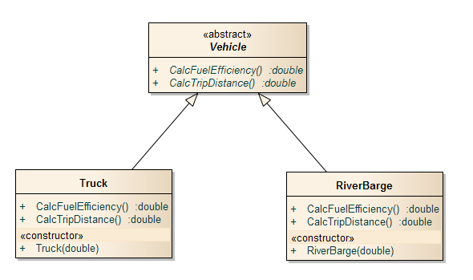
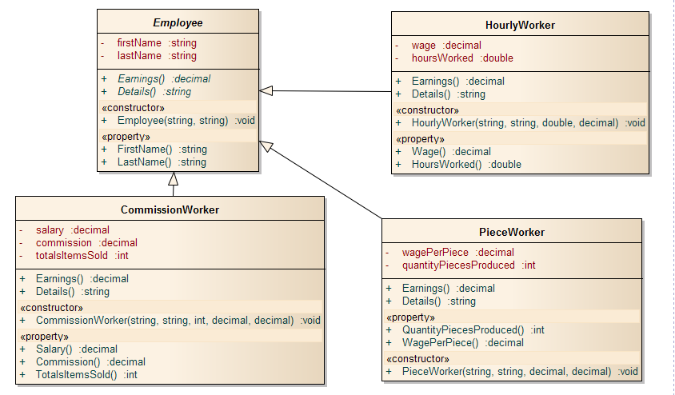
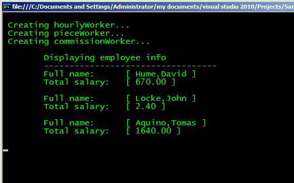

# Understanding abstract classes with C#
        

            The C# programming language enables a class designer to specify that a base class declares a method that does not supply an implementation. This is called an abstract method. The implementation of this method is supplied by the derived classes. Any class with one or more abstract method is called an <i>abstract class</i>.
            

            
<b>Fig 1 UML model of the abstract class.</b>
 
            

 

The purpose of an abstract class is primarily to provide an appropriate base class from which other classes can inherit and thus share a common design.
However, abstract classes can have data attributes, concrete methods, and constructors. For example, the Vehicle class might include <i>load</i> and <i>maxLoad</i> attributes and a constructor to initialize them.
            Not all inheritance hierarchies contain abstract classes. However, programmers often write client code that uses only abstract base class types to reduce the client code's dependencies on a range of specific derived class types. 
The C# compiler always prevents you form instantiating an abstract class, for example the following statement is illegal.
            

            <pre>
             Vehicle v = new Vehicle(); // this is illegal and the compiler generates an error.
            </pre>
            

            Although we cannot instantiate objects of abstract base classes,  we will see that we can use abstract base classes to declare variables that can hold references to objects of any concrete classes derived from those abstract classes.
            

            <h3>The employee abstract class: A example using Polymorphism through inheritance</h3>
            <h4>What is polymorphism?</h4>
            

            The term polymorphism refers to the ability of two or more objects belonging to different classes to respond to exactly the same message (method call) in different class-specific ways, thus polymorphism enables us to "program in the general" rather than "program in the specific".
            

            

            Polymorphism allows:
            <ul>
            <li>Different behavoirs from the same type.</li>
            <li>Runtime polymorphism is done via overriding.</li>
            <li>Compile time polymorphism is done via method overloading.</li>
            <li>Invoke methods of a derived class through a base class.</li>
            </ul>
            I think the best way to learn about this concept is through an example, so I wrote a set of examples using an inheritance hierarchy containing types of employees in a company.
            

            
<b>Fig 2 Employee hierarchy UML class diagram.</b>
 
            

 
            

            We use abstract class Employee to represent the general concept of an employee. The classes that inherit from Employee are: <i>CommissionEmployee</i>, <i>PieceEmployee</i> and <i>HourlyEmployee</i>.
            

            

            1. I use abstract class Employee to represent the general concept of an employee. The classes that inherit from Employee are: <i>CommissionEmployee</i>, <i>PieceEmployee</i> and <i>HourlyEmployee</i>.
            

            

            In this example, class Employee will provide two methods <i>Earnings</i> and <i>Details</i>, and properties that manipulate an Employee's instance variables, the method <i>Earnings</i> certainly applies generally to all employee's, but each earnings calculation depends on the derived employee's class. So these two methods must be abstract in the Employee class because an implementation does not make sense there, so each derived class must override those methods with an appropriate implementation.
            

            

            2.  I wrote three concrete classes: <i>HourlyWorker</i>, <i>CommissionWorker</i> and <i>PieceWorker</i>. Such classes provide implementations of the abstracts methods declared in our abstract class, because abstract base classes are too general to create real objects.
            

            

            To test our example, the following program creates an array of our abstract base class Employee, then assigns the four instances of  our  concretes classes to the array variable. Finally, the program iterates through array Employee and polymorphically invokes methods <i>Earnings</i> and <i>Details</i> to display the output of each of these methods.
            

            
<b>Fig 3. The output for our example.</b>
 
            

 
            
Note: <q>Those examples were based on the examples included in: Deitel's developer series C# 2010 for programmers.</q>

